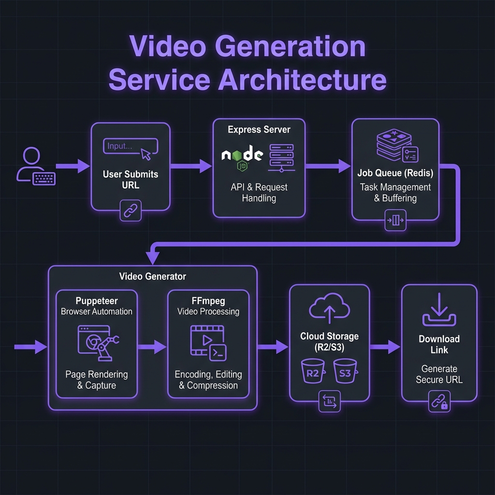

<div align="center">


# AutoPromo.video

**Transform any website URL into a professional marketing video in 60 seconds**

[](https://github.com/Ansarii/autopromo-video/actions/workflows/node.js.yml)
[](LICENSE)
[](https://nodejs.org/)
[](CONTRIBUTING.md)
[](https://github.com/Ansarii/autopromo-video/graphs/commit-activity)
[](https://github.com/Ansarii/autopromo-video/stargazers)

[Features](#-features) • [Quick Start](#-quick-start) • [Demo](#-demo) • [Documentation](#-documentation) • [Contributing](#-contributing)

</div>

---

## 🎯 What is AutoPromo.video?

AutoPromo.video is an **AI-powered automated marketing video generator** that transforms any website into a professional promotional video. Simply paste a URL, and our system automatically captures, navigates, and creates stunning videos with:

- 🎬 **Cinematic camera movements** with Pro Director 2.0
- 🤖 **Intelligent interaction** - automatically clicks buttons and fills forms
- 🎵 **Professional background music** from a curated library
- 🎨 **Custom branding** with logo overlays and fonts
- ⚡ **Lightning-fast generation** - videos ready in under 60 seconds

Perfect for SaaS demos, product showcases, landing page promotions, and social media marketing.

## ✨ Features

### Core Capabilities
- 🌐 **Automated Web Capture** - Renders any website with Puppeteer
- 🎥 **Multiple Formats** - 16:9 (landscape) and 9:16 (portrait) support
- ⏱️ **Flexible Duration** - 15s, 30s, 45s, or 60s videos
- 🎭 **Two Generation Modes**:
  - **Simple Scroll** - Clean page scroll with music
  - **Pro Director 2.0** - Multi-shot cinematic sequences with dynamic camera movements
- 🎼 **Background Music** - Multiple royalty-free tracks included
- 🖼️ **Logo Overlay** - Add your brand logo with position customization
- 📊 **Interactive Demos** - Automatically navigates and demonstrates functionality
- 💾 **Cloud Storage** - Integrated with Cloudflare R2 / AWS S3

### Technical Features
- 🔒 **Rate Limiting** - Built-in job queue with Redis
- 🐳 **Docker Support** - Easy deployment anywhere
- 🚀 **Production Ready** - Designed for Render, Heroku, or self-hosting
- 📡 **REST API** - Full programmatic access
- 🛡️ **Security** - Helmet.js, CORS, input validation

```bash
# Quick example
curl -X POST http://localhost:3000/api/jobs \
  -H "Content-Type: application/json" \
  -d '{"url": "https://www.neoninnovationlab.com", "format": "16:9", "duration": 30}'
```

## 🚀 Quick Start

### Prerequisites

- **Node.js** 20 or higher
- **FFmpeg** installed on your system
- **Redis** (Upstash free tier works great)
- **Cloud Storage** account (Cloudflare R2 or AWS S3)

### Installation

1. **Clone the repository**
   ```bash
   git clone https://github.com/Ansarii/autopromo-video.git
   cd autopromo-video
   ```

2. **Install dependencies**
   ```bash
   npm install
   ```

3. **Install FFmpeg**
   ```bash
   # macOS
   brew install ffmpeg
   
   # Ubuntu/Debian
   sudo apt-get install ffmpeg
   ```

4. **Configure environment variables**
   ```bash
   cp .env.example .env
   # Edit .env with your credentials
   ```

5. **Start the server**
   ```bash
   npm run dev
   # Server runs on http://localhost:3000
   ```

## ⚙️ Configuration

Create a `.env` file based on `.env.example`. See [docs/CONFIGURATION.md](docs/CONFIGURATION.md) for detailed configuration options.

## 📖 Usage

### Web Interface

1. Open `http://localhost:3000` in your browser
2. Paste any website URL
3. Select format (16:9 or 9:16)
4. Choose generation mode (Simple Scroll or Pro Director)
5. Select duration (15s, 30s, 45s, or 60s)
6. Click "Generate Video"
7. Download your professional marketing video!

### API

See [docs/API.md](docs/API.md) for complete API documentation.

## 🏗️ Architecture



See [docs/ARCHITECTURE.md](docs/ARCHITECTURE.md) for a deep dive into how it works.

## 🛠️ Tech Stack

- **Backend**: Node.js (Express)
- **Browser Automation**: Puppeteer
- **Video Processing**: FFmpeg (fluent-ffmpeg)
- **Queue**: Upstash Redis
- **Storage**: Cloudflare R2 / AWS S3
- **Frontend**: Vanilla JavaScript, TailwindCSS
- **Deployment**: Docker, Render, Heroku

## 📚 Documentation

- [API Reference](docs/API.md)
- [Configuration Guide](docs/CONFIGURATION.md)
- [Deployment Guide](docs/DEPLOYMENT.md)
- [Technical Architecture](docs/ARCHITECTURE.md)
- [Frequently Asked Questions](docs/FAQ.md)
- [Contributing Guidelines](CONTRIBUTING.md)
- [Security Policy](SECURITY.md)

## 🚢 Deployment

See [docs/DEPLOYMENT.md](docs/DEPLOYMENT.md) for detailed platform-specific instructions.

## 🤝 Contributing

We love contributions! Please read our [Contributing Guidelines](CONTRIBUTING.md) to get started.

See our [Code of Conduct](CODE_OF_CONDUCT.md) for community guidelines.

## 🐛 Bug Reports & Feature Requests

Found a bug or have an idea? Please [open an issue](https://github.com/Ansarii/autopromo-video/issues/new/choose) using our templates.

## 📝 License

This project is licensed under the MIT License - see the [LICENSE](LICENSE) file for details.

---

<div align="center">

**Made with ❤️ by the AutoPromo.video team**

[Website](https://autopromo-video.vercel.app) • [Neon Innovation Lab](https://www.neoninnovationlab.com/) • [GitHub](https://github.com/Ansarii/autopromo-video)

⭐ Star us on GitHub — it helps!

</div>
